# **<u>Projet "JEE / Architecture Micro-Service</u>"**

#### *Application basée sur une architecture micro-service qui permet de gérer les absences dans une école.*

---

##### Table des matières

1. Cahier des charges
   
   1. Objectif
   
   2. Architecture global du projet

2. Backend
   
   1. Configuration
   
   2. Docker
   
   3. Réalisation des microservices

---

## **<u>Cahier des charges</u>**

### <u>Objectif</u>

Notre objectif principal est de développer une application web avec ***Angular*** on **Frontend** et ***Spring Boot*** on **Backend** , en implementons une architectures basé sur **Les Micro-Services**. Cette application web va nous permettra de:

- Gérer les étudiants.

- Gérer les cours.

- Gérer les professeurs.

- Gérer les absences des étudiants.

- Gérer les membres du staff.

De plus de ça, il faut implementer **L'authentification & L'autorisation** de l'application on utilison ***Keycloak***. L'application aussi dois avoir support la communication ***Synchrone*** entre les microservices avec **Spring OPENFEIGN**, et la communication **Asynchrone** avec **KAFKA**.

Puis **contenarisé** chaque microservices dans un contenaire **Docker**.

### <u>Architecture global du projet</u>

Notre application contient 2 partie, **Frontend** avec **Angular** et **Backend** avec **Spring Boot**. La partie <u>Backend</u> est constitué des microservices suivantes:

- Eureka Discovery Service

- Gatewaye Service

- Keycloak Service + Sa propre base de données **POSTGRES**.

- Student Service + Base de données **MySQL**.

- Professor Service + Base de données **MySQL**.

- Staff Service + Base de données **MySQL**.

- Absence Service + Base de données **MySQL**.

- Course Service + Base de données **MySQL**.

- Kafka + Zookeeper.

- Absence Random Data Generator Service.

- Data Analytics Service.

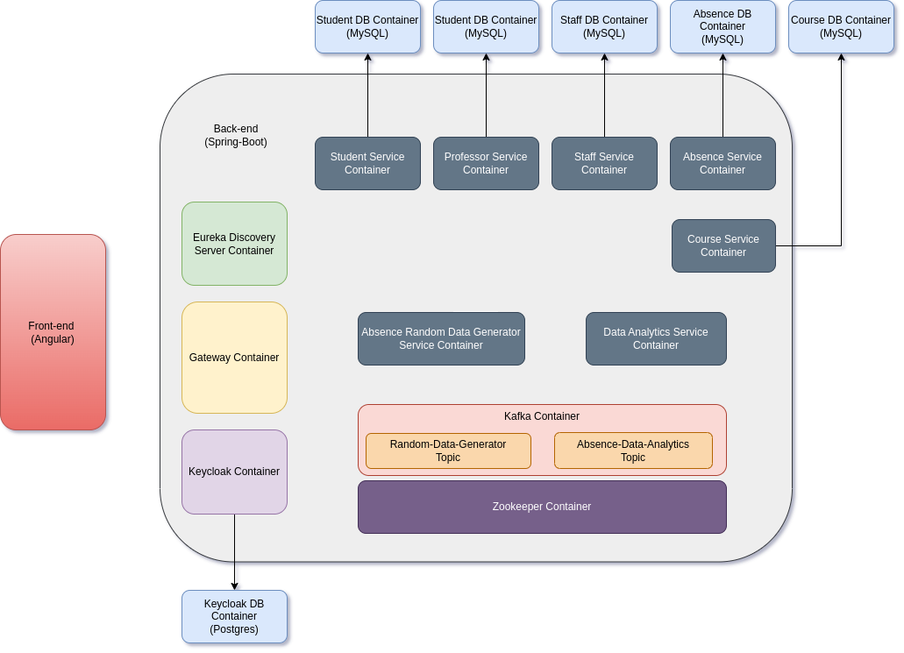


---

## <u>Backend</u>

### <u>Configuration</u>

Dans l'ensemble des microservices qu'on va créer dans ce projet, on va utilisé la version **2.7.8 de Spring Boot** et la version **17 de java**.

### <u>Docker</u>

Aprés la créations de chaque microservices, on aura besoin de créer notre propre image Docker depuis ce microservice. Pour cela on aura besoin d'avoir installer 'Docker' sur notre machine, puis télecharger quelque image de base au quelle on aura besoin dans ce projet.

Pour installer 'Docker' sur *Windows ou Mac* allez vers le [site officiel](https://www.docker.com/products/docker-desktop/ "Docker Officiel Web Site"). Dans notre cas on utilise une machine ***Ubuntu / Linux***, pour sela on va executer la commande suivante dans notre terminal.

```shell
sudo apt-get update 
sudo apt-get upgrade
sudo apt-get install docker-ce docker-ce-cli containerd.io docker-buildx-plugin docker-compose-plugin
```

puis on verifie la version installer de Docker on executons la commande

```shell
docker --version # La version 23.0.0 dans notre cas
```

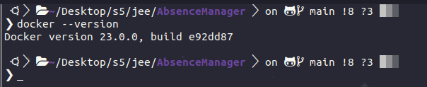


L'etape suivante est de télecharger depuis **'DockerHub'** les images au quelle on aura besoin.

- **JDK 17**
  
  ```shell
  sudo docker pull eclipse-temurin:17-jdk-alpine
  ```

- **MySQL**
  
  ```shell
  sudo docker pull mysql:8
  ```

- **Postgres**
  
  ```shell
  docker pull postgres:alpine
  ```

- **Nodejs**
  
  ```shell
  sudo docker pull node:alpine3.16
  ```

- **wurstmeister/kafka**
  
  ```shell
  sudo docker pull wurstmeister/kafka:latest
  ```

- **wurstmeister/zookeeper**
  
  ```shell
  sudo docker pull wurstmeister/zookeeper:latest
  ```

- **quay.io/keycloak/keycloak**
  
  ```shell
  sudo docker pull wurstmeister/zookeeper:latest
  ```

### <u>Réalisation des microservices</u>

#### <u>Création d'un nouveau projet vide</u>

La première étape c'est de créer un <u>projet java vide</u>, dans le quel on grouper l'ensemble des **microservices** qu'on va créer sous forme des **<u>*Module*</u>**. On va nommée notre projet backend: **"AbsenceManage"**.

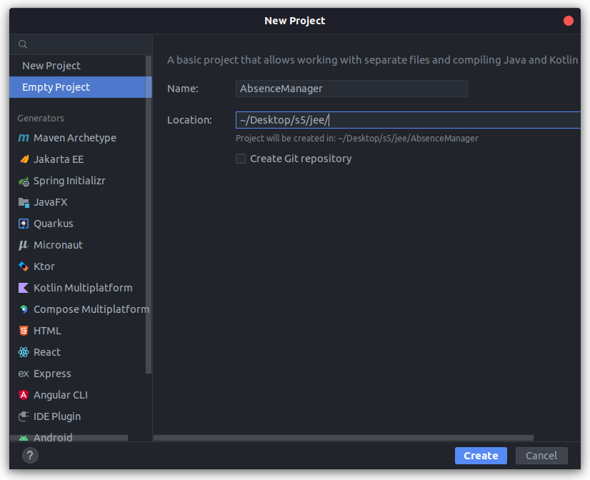


#### <u>Eureka Discovery Service</u>

Le **Discovery Service**, c'est lui qui va prendre on charge de collecter les informations sur l'ensemble des microservices qui existe dans notre projet.

On créer un nouveaux module avec les depéndences suivante:

```xml
<dependency>
    <groupId>org.springframework.boot</groupId>
    <artifactId>spring-boot-starter-actuator</artifactId>
</dependency>
<dependency>
    <groupId>org.springframework.cloud</groupId>
    <artifactId>spring-cloud-starter-netflix-eureka-server</artifactId>
</dependency>
```

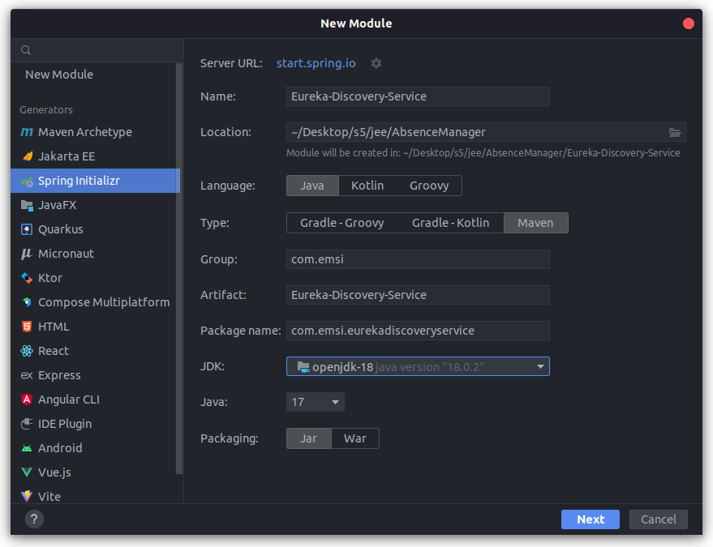

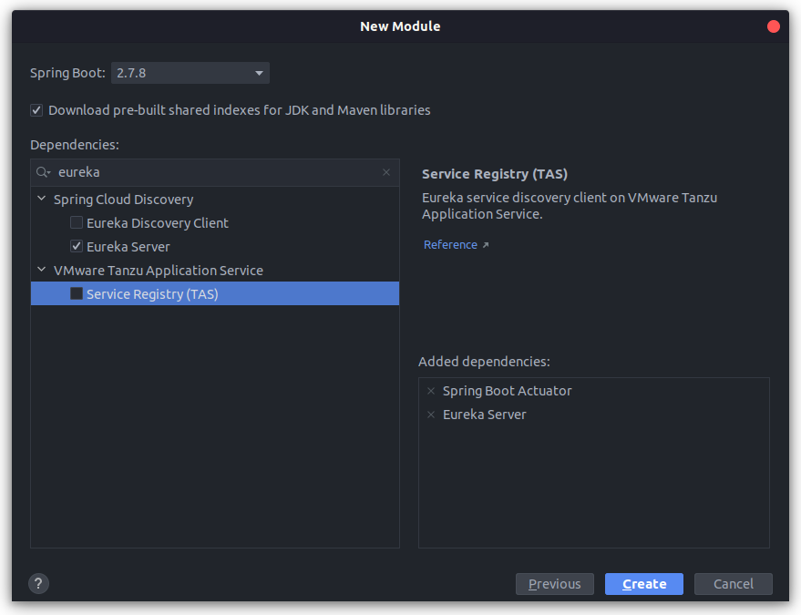

Une fois le microservice est créer. On va **<u>'Activer Eureka Server'</u>** on ajouton l'annotation **"@EnableEurekaServer"** dans la classe de demarage.

```java
@SpringBootApplication
@EnableEurekaServer
public class EurekaDiscoveryServiceApplication {

    public static void main(String[] args) {
        SpringApplication.run(EurekaDiscoveryServiceApplication.class, args);
    }

}
```

puis on lui affect sa propre configuration on modiffion le fichier **application.properties** 

```properties
server.port=8761
eureka.client.fetch-registry=false
eureka.client.register-with-eureka=false    
```


L'etape suivate est de générer un fichier **.jar** qu'on va deplacer vers notre contenaire pour créer notre propre image Docker. pour cela on execute les 2 commandes "**Maven**"  suivante:

```shell
mvn clean
mvn install
```

ou bien on peut le créer de puis l'interface **"maven"** d'**Intelij**.

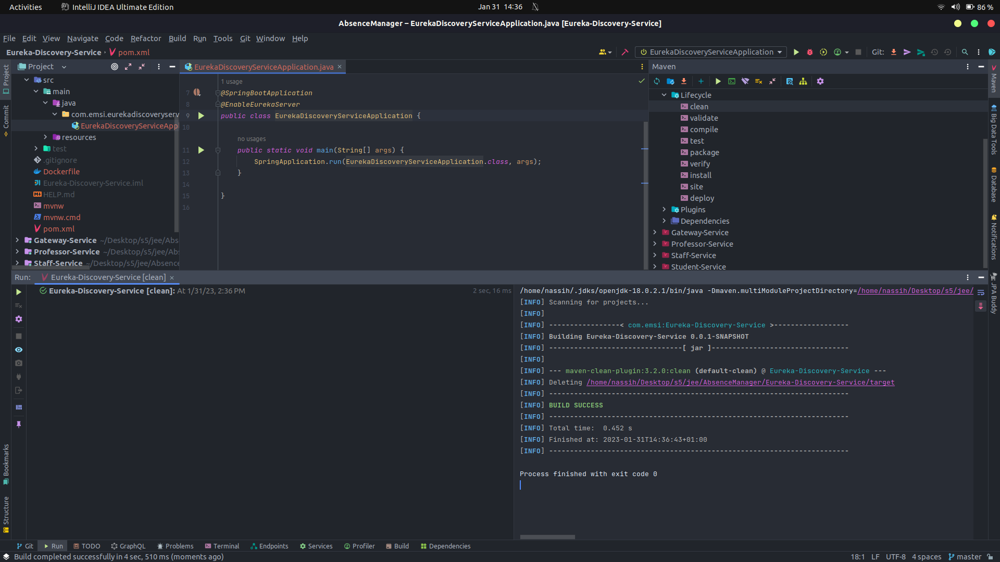

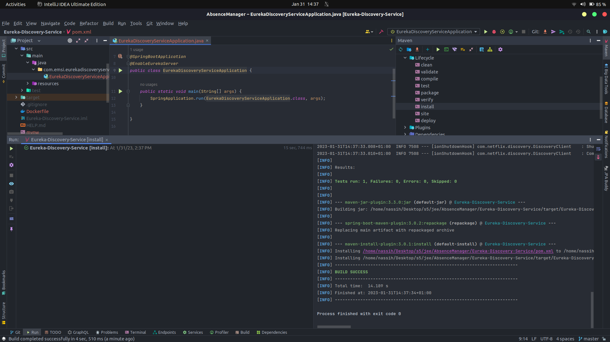

Une fois elles sont bien éxecuté, un fichier nommé *<u>**Eureka-Discovery-Service-0.0.1-SNAPSHOT.jar**</u>* sera créer dans le dossier "**/targer**".


Une fois on a notre fichier ".jar", on va créer note fichier "**Dockerfile**", dans le quel on va spécifier les étapes que Docker va suivre pour créer notre image.

```dockerfile
FROM eclipse-temurin:17-jdk-alpine
ARG JAR_FILE=target/*.jar
COPY ./target/Eureka-Discovery-Service-0.0.1-SNAPSHOT.jar app.jar
ENTRYPOINT ["java", "-jar", "/app.jar"]
```

Sela indique indique a Docker les étapes a suivre pour créer notre image docker.

- "**FROM**": Indique a docker l'image sur laquelle il va se basé pour créer notre image dans ce cas c'est **JAVA17**, on a choisi la version '*alpine*' car elle a la taille la plus petits.

- "**ARG**": Indique l'emplacement du fichier jar.

- "**COPY**": Dans cette instruction, docker va copier le fichier ".jar" de puis notre machine local vers le contenaire, et il va lui affecter le nom "**app.jar**".

- "**ENTRYPOINT**": Point de demarage, ou la commande laquelle docker va éxecuter pour démarrer notre application dans le contenaire.


Pour créer notre image docker, "**BUILD**", on va executer la commande

```shell
sudo docker build -t absence/eureka-server:0.1 .
```

*Le flag -t nous permet de donnée a notre image un nom, dans ce cas 'absence/eureka-server', puis si on veux spécifier une version on l'ajoute apres les ':', si on la spécifier pas elle sera par defaut "latest", puis le '.' signifier l'emplacement du "**Dockerfile**" dans ce cas c'est l'emplacement courant*.


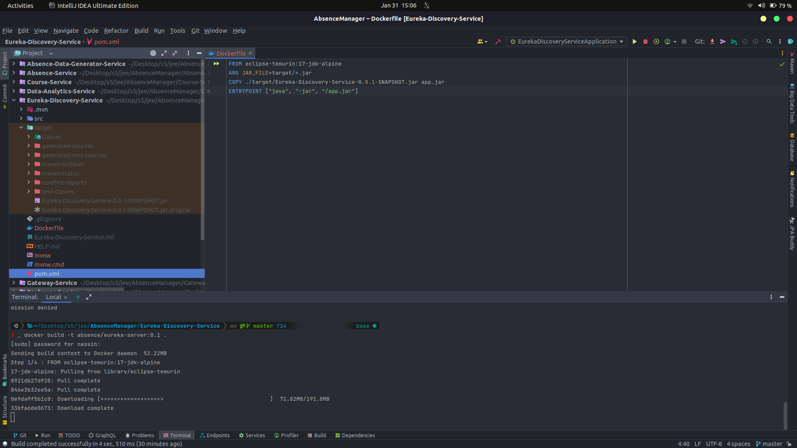

une fois terminer, on verifier l'existance de notre image on éxecutons la commande

```shell
sudo docker image ls
```

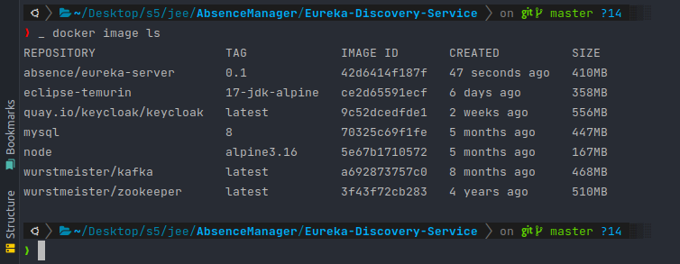

**Notre image a été bien créer**. l'etape suivante est de la tester. pour cela on va démarrer un contenaire depuis cette image avec la commande:

```shell
sudo docker run -d -p 8761:8761 absence/eureka-server:0.1
```

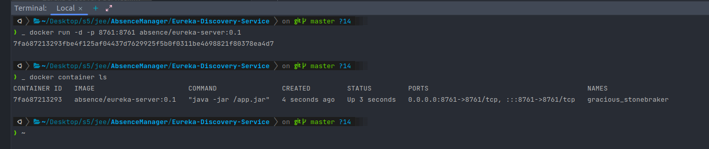

Le flag "-d" est pour spécifier a docker de demarrer ce contenaire on '**background**' pour ne pas blocké le terminal, le flag "-p" pour spécifier le port pour acceder au contenaire, le premier port c'est le port sur la machine local et le 2ème c'est le port sur lequel l'application ecoute dans le contenaire, et c'est le meme port donné a l'application dans le fichier *application.properties*.


Une fois demarrer on ouvre notre "brouser" et on ouvre "*<u>**localhost:8761**</u>*" pour acceder a l'application

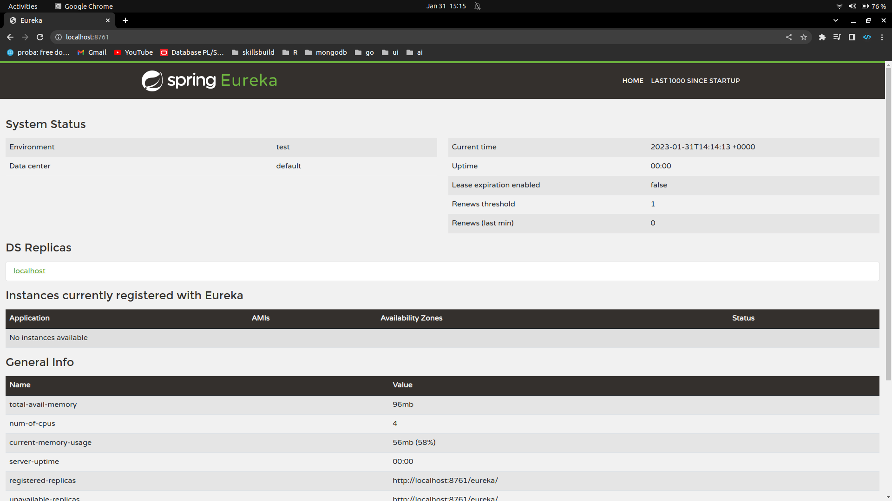


:boom: :boom: :boom:   **Est Voila comme ca on a créer notre premier microservices est on a créer une image docker depuis ce microservice**. :boom: :boom: :boom: 


#### <u>Gatewaye Service</u>

La "**Gateway**", va prendre on charge de faire du *Load ballancing* et du *Routage* des requettes qui vient de la part du client. On va configurer le <u>**routage**</u> dans notre projet avec une magnier **Dynamic**, mais on va l'implementes avec une magnier **Static** aussi, mais elle sera pas utilisé.

Pour créer la **Gateway**, on va generer un nouveau <u>module</u> de la meme magnier que **Eureka Discovery** mais avec les dependances suivante:

```xml
<dependency>
	<groupId>org.springframework.boot</groupId>
	<artifactId>spring-boot-starter-actuator</artifactId>
</dependency>
<dependency>
	<groupId>org.springframework.cloud</groupId>
	<artifactId>spring-cloud-starter-gateway</artifactId>
</dependency>
<dependency>
	<groupId>org.springframework.cloud</groupId>
    <artifactId>spring-cloud-starter-netflix-eureka-client</artifactId>
</dependency>
```

**application.properties**

```properties
server.port=8080
spring.application.name=gateway-service
management.endpoints.web.exposure.include=*
spring.cloud.discovery.enabled=true
```

La plus important c'est "**spring.cloud.discovery.enabled=true**", cette proprieté va permettre au "**gateway**" a s'enregister dans le discovery service.

**Routage Dynamic**

Pour activer le routage **dynamic** il faut ajouter un **<u>@Bean</u>** de type **<u>DiscoveryClientRouteDefinitionLocator</u>** qui va permettre au 'gateway' de trouver les paths des microcervices. pour l'activé on ajoute le @Bean suivant:

```java
@Bean
DiscoveryClientRouteDefinitionLocator dynamicRoutes(ReactiveDiscoveryClient rdc, DiscoveryLocatorProperties dlp){
	return new DiscoveryClientRouteDefinitionLocator(rdc, dlp);
}
```

**Routage Static**

Pour configurer le routage static on a 2 methodes, la première est de configurer un **@Bean** de type **<u>RouteLocator</u>** puis on definier chaque route manuellement.

```java
@Bean
RouteLocator gatewayRoutes(RouteLocatorBuilder builder){
	return builder.routes()
			.route(r -> r.path("/students/**").uri("lb://STUDENT-SERVICE"))
			.route(r -> r.path("/staffs/**").uri("lb://STAFF-SERVICE"))
			.route(r -> r.path("/professors/**").uri("lb://PROFESSOR-SERVICE"))
    		.route(r -> r.path("/courses/**").uri("lb://COURSE-SERVICE"))
			.route(r -> r.path("/absences/**").uri("lb://ABSENCE-SERVICE"))
			.build();
}
```

La deuxieme methode est de créer un fichier '**configuration.yml**' dans lequel on va les redéfinir.

```yaml
spring:
 cloud:
   gateway:
     routes:
       - id: r1
         uri: lb://CLIENT-SERVICE
         predicates:
           - Path= /clients/**

       - id: r2
         uri: lb://STAFF-SERVICE
         predicates:
           - Path= /staffs/**

       - id: r3
         uri: lb://PROFESSOR-SERVICE
         predicates:
           - Path= /professors/**

       - id: r4
         uri: lb://COURSE-SERVICE
         predicates:
           - Path= /courses/**

       - id: r5
         uri: lb://ABSENCE-SERVICE
         predicates:
           - Path= /absences/**
```

**Creation du jar**

Du meme magnier que le "**Discovery Service**", depuis l'interface d'Intelij, on va génerer notre fichier '.jar'. Un fichier nommée "**Gateway-Service-0.0.1-SNAPSHOT.jar**" sera créer dans le dossier "**./target**".

**Dockerfile**

```dockerfile
FROM eclipse-temurin:17-jdk-alpine
ARG JAR_FILE=target/*.jar
COPY ./target/Gateway-Service-0.0.1-SNAPSHOT.jar app.jar
ENTRYPOINT ["java", "-jar", "/app.jar"]
```

**Création d'image**

On execute la commande de "**build**" du dockerfile, puis on check la création de notre image.

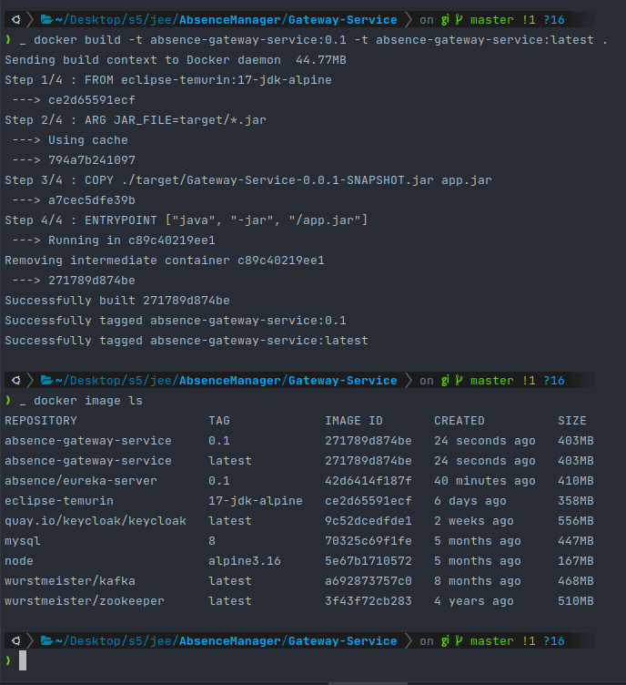
